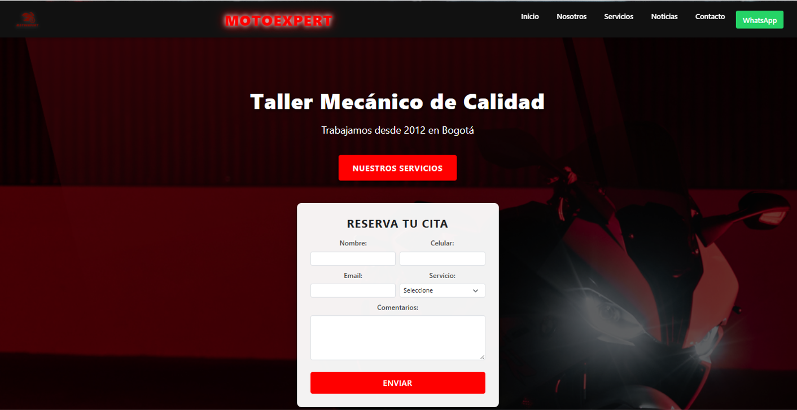

# Taller Mecánico MotoExpert

Aplicación web completa para gestión de reservas y servicios de taller mecánico especializado en motocicletas.

## Características Principales

- Sistema de reserva de citas online
- Catálogo completo de servicios
- Información detallada del taller
- Sección de noticias y consejos
- Formulario de contacto integrado
- Diseño responsive para todos los dispositivos
- Panel de administración (en desarrollo)

## Estructura del Proyecto
RESEVA_TALLER_MOTO/
├── backend/ # Servidor y lógica de negocio
│ ├── app.py # Aplicación principal
│ ├── models.py # Modelos de datos
│ └── routes/ # Controladores de rutas
├── templates/ # Plantillas HTML
│ ├── index.html # Página principal
│ ├── servicios.html # Catálogo de servicios
│ ├── nosotros.html # Información del taller
│ ├── noticias.html # Artículos y consejos
│ └── contacto.html # Formulario de contacto
├── static/ # Archivos estáticos
│ ├── css/ # Hojas de estilo
│ ├── js/ # Scripts JavaScript
│ └── images/ # Imágenes y recursos visuales
├── others/ # Documentación adicional
├── README.md # Este archivo
└── requirements.txt # Dependencias de Python
